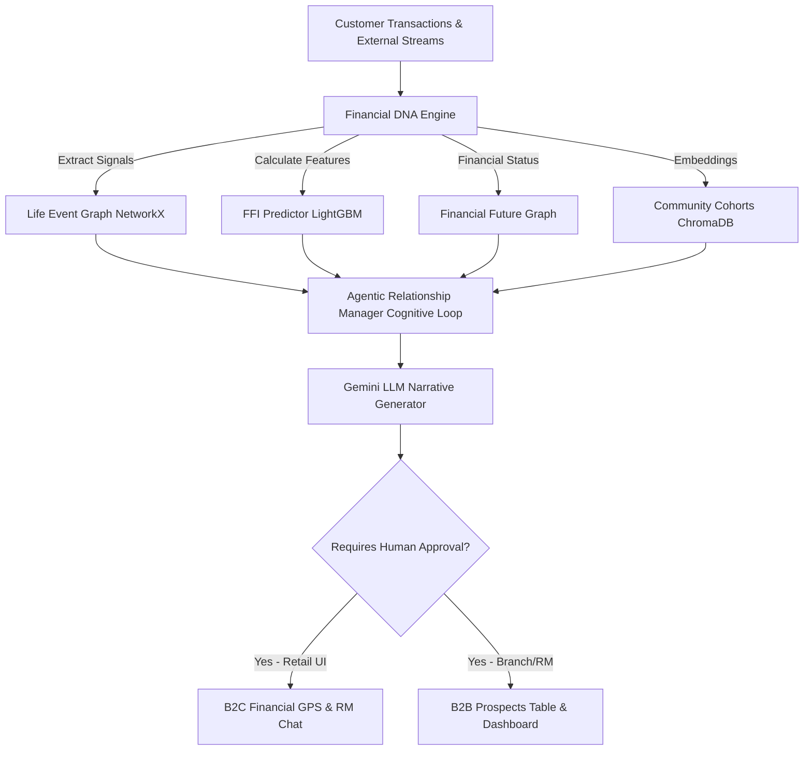

# Saathi AI — Trajectory-Based Agentic Relationship Manager for SBI

> **"Help banks understand not only who customers are today, but who they are becoming."**

Saathi AI is an **Explainable Agentic AI** platform built for next-generation digital banking. Instead of looking backward at static transaction histories, Saathi AI analyzes financial behaviors to predict upcoming life milestones (e.g., home purchase, marriage, business creation) and maps out proactive, hyper-personalized product recommendation journeys before the customer even asks.

Designed for the **SBI Hackathon @ GFF 2026** under **Pillar 03: Digital Engagement** and **Pillar 01: Customer Acquisition**.

---

## 🔗 Live Demo Links

* 💻 **Frontend Web App:** [https://3fa3150c698517.lhr.life](https://3fa3150c698517.lhr.life)
* ⚙️ **Backend API Docs:** [https://c7d7c7f82d25b9.lhr.life/docs](https://c7d7c7f82d25b9.lhr.life/docs)

---

## 🛠️ System Architecture & Process Flow

Saathi AI uses a hybrid AI architecture combining predictive ML (XGBoost/LightGBM), deterministic graphs (NetworkX), and constrained natural language generation (LLMs) to ensure 100% explainable, hallucination-free advice.



### Cognitive Loop Action Flow:
1. **Observe:** Pulls raw transactional data, category metrics, peer cohorts, and wealth projections.
2. **Reason:** Links behavioral signals to predicted upcoming milestones.
3. **Predict:** Assigns probability scores to events (e.g., buying a house) and identifies financial gaps.
4. **Explain:** Audits the exact node paths in the knowledge graph that triggered the prediction.
5. **Recommend:** Creates a customized savings roadmap (**Financial GPS**) and details the product pitch.
6. **Narrate:** Constrained LLM drafts an empathetic, conversational explanation.

---

## ⚙️ Core Engines & Modules

| # | Engine | Location | Responsibility |
|---|--------|----------|----------------|
| 1 | **Financial DNA Engine** | `backend/app/engines/dna.py` | Extracts behavioral vectors (e.g., savings rates, rent payments, luxury spend ratios). |
| 2 | **Life Event Knowledge Graph** | `backend/app/engines/life_event_graph.py` | A NetworkX graph linking transaction signals to life stages (Marriage, Home Purchase, etc.). |
| 3 | **Financial Future Graph** | `backend/app/engines/future_graph.py` | Projects balance history and asset values 24 months forward. |
| 4 | **Financial Future Index (FFI)** | `backend/app/engines/ffi.py` | Computes a composite financial health score (0-100) using a trained LightGBM model. |
| 5 | **Financial GPS** | `backend/app/engines/gps.py` | Formulates goal allocation roadmaps and computes monthly saving plans. |
| 6 | **Agentic Relationship Manager** | `backend/app/agent/rm.py` | Executes the Observe ➔ Reason ➔ Predict ➔ Explain ➔ Recommend loop. |
| 7 | **Community Intelligence Layer** | `backend/app/engines/community.py` | Clusters peer cohorts using ChromaDB to extract peer benchmark trends. |

---

## 🎯 SBI Judge Demo Walkthrough (Rahul)

We have preloaded the dashboard with a representative profile, **Rahul** (28, Bangalore, salary ₹65,000, savings ₹4,00,000):

1. **Dashboard Load:** The UI loads Rahul's data. His **Financial Future Index (FFI)** is **82**, driven by strong savings growth and regular rent payments.
2. **Life Event Graph:** Surfaces a **93% probability** of a **Home Purchase** in the near future based on savings behavior.
3. **Financial GPS:** Plans for his goal ("Buy House at ₹18L" with a ₹15L gap) and recommends saving ₹41,000/month across SBI Recurring Deposits and Mutual Fund SIPs.
4. **Agentic RM:** The chat box details the personalized reasoning (e.g., how consistent rent payments make him an ideal candidate for an SBI Home Loan).
5. **B2B Prospects Table:** On the bank's side, Rahul is highlighted as a high-value lead for a home loan, enabling branch RMs to proactively target and pre-approve his application.

---

## 💻 Local Quickstart

### Option A: Running with Docker (Recommended)
Launch the entire system (Frontend, Backend, Database) in seconds:
```bash
docker compose up --build
```
* **Frontend:** [http://localhost:5173](http://localhost:5173)
* **Backend API Docs:** [http://localhost:8000/docs](http://localhost:8000/docs)

### Option B: Running Manually (Development)
#### 1. Setup Backend
```bash
cd backend
python -m venv .venv && source .venv/bin/activate
pip install -r requirements.txt
python -m app.data.generator      # Generates synthetic database
python -m app.ml.train_ffi        # Trains the FFI LightGBM model
uvicorn app.main:app --reload --port 8000
```

#### 2. Setup Frontend
```bash
cd ../frontend
npm install
npm run dev                       # Launches Vite dev server at http://localhost:5173
```

---

## 🛡️ Compliance & Safety Posture

* **Human-in-the-Loop:** Every recommendation returned by the Agentic RM includes a `requires_human_approval` flag. No money is moved and no contract is initiated without explicit customer consent.
* **Secured LLM Processing:** The LLM does not perform calculations or state changes. It purely narrates the structured outputs from deterministic Python engines, preventing hallucinations.
* **Production Ready:** Core banking interfaces (Account Aggregator, UPI, SBI Core) are abstracted behind adapter layers, making local synthetic data easily swappable for live enterprise APIs.
