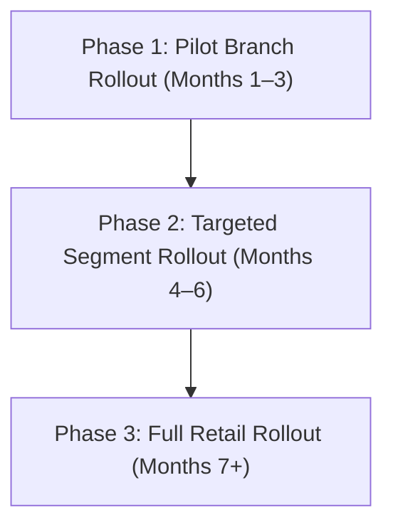

# Saathi AI - Business Potential & ROI Impact Model

This document outlines the business potential and return on investment (ROI) for **Saathi AI** when deployed at the scale of the State Bank of India (SBI). 

---

## 1. Executive Summary & Narrative
Traditional retail banking marketing relies on broad mass-marketing channels (e.g., broad SMS campaigns, generic banners on net banking portals, and cold calling). These channels suffer from:
1.  **Low Conversion Rates**: Typically around **0.5%** or less due to irrelevant targeting.
2.  **High Customer Fatigue**: Bombarding 100% of the customer base causes marketing blindness.
3.  **Inefficient Cost-per-Acquisition (CPA)**: Capital is wasted contacting customers who have no immediate financial need.

**Saathi AI** solves this by shifting from mass outreach to **agentic, event-driven targeting**:
*   Instead of broad campaigns, the AI engine monitors transactional signals (via the FFI and Life Event Graph) to predict specific, high-probability needs (e.g., home loans, wedding financing, SIPs).
*   Outreach is limited to the top **10% of customers** showing active signals.
*   By targeting only warm prospects, conversion rates rise from **0.5% to 2.5%** (a 5x relative uplift), while marketing costs fall by **90%** since 90% of the base is left untouched.

---

## 2. ROI Model Analysis (Targeted 10% Cohort Example)

Based on conservative retail banking benchmarks (representing modeled estimates rather than measured SBI data), the following table compares a standard broad campaign against a Saathi AI-targeted campaign:

| Metric | Baseline Mass-Marketing | Saathi AI Targeted Campaign | Improvement / Delta |
| :--- | :--- | :--- | :--- |
| **Outreach Contact Base** | 500,000,000 | 50,000,000 | **90% decrease in contacts** |
| **Campaign Cost** (at ₹5.00/contact) | ₹2,500,000,000.00 | ₹250,000,000.00 | **₹2,250,000,000.00 savings** |
| **Acquired Conversions** | 2,500,000.00 | 1,250,000.00 | — |
| **Cost Per Acquisition (CPA)** | ₹1,000.00 | ₹200.00 | **₹800.00 saved per acquisition** |
| **Gross Yield/Revenue** (at ₹25,000/acq) | ₹62,500,000,000.00 | ₹31,250,000,000.00 | — |
| **Campaign ROI Multiple** | 25.0x | 125.0x | **5x higher efficiency** |

### Key Incremental Value Highlights
*   **Incremental Conversions on Target Base**: **1,000,000** additional accounts compared to mass contacting only that subsegment.
*   **Incremental Revenue / Net Interest Income (NII)**: **₹25,000,000,000.00** in incremental lifetime value.
*   **Outreach Cost Savings**: Direct reduction of **₹2,250,000,000.00** in digital communications overhead.

*Disclaimer: These figures are modeled estimates based on standard retail banking industry averages and do not represent internal, measured SBI performance metrics.*

---

## 3. 3-Phase Monetization Roadmap

To capture this potential without operational disruption, we propose a structured rollout:

### Phase 1: Pilot Branch Rollout (Months 1–3)
*   **Scope**: Deploy Saathi AI RM interface to **10 pilot branches** in metro cities (e.g., Bangalore, Mumbai).
*   **Operations**: RMs use the UI to view daily prospect lists ranked by FFI for `home_purchase` and `investment_readiness`. Outbound calls are manually verified and completed by the branch RMs.
*   **Success Metrics**: Achieve a conversion rate $> 1.5\%$ on generated recommendations and capture RM feedback.

### Phase 2: Targeted Segment Rollout (Months 4–6)
*   **Scope**: Expand deployment to all branches within **one specific customer segment** (e.g., Premium/HNI Retail or Salary Package accounts).
*   **Operations**: Integrate the prediction pipeline with corporate CRM. Enable automated email/SMS dispatch of personalized, consent-gated loan pre-approvals via net banking banners.
*   **Success Metrics**: Achieve a conversion rate $> 2.0\%$ and lower total acquisition cost (CPA) by 50%.

### Phase 3: Full Retail Rollout (Months 7+)
*   **Scope**: Deploy across the entire **SBI Retail and MSME base** (approx. 500 million customers).
*   **Operations**: Connect state-level distributed sharded databases. Embed the agent directly into the YONO mobile application to offer real-time, context-aware financial suggestions based on immediate UPI transactions.
*   **Success Metrics**: Target massive ₹2,000 Crore+ marketing cost savings and ₹20,000 Crore+ NII generation.
